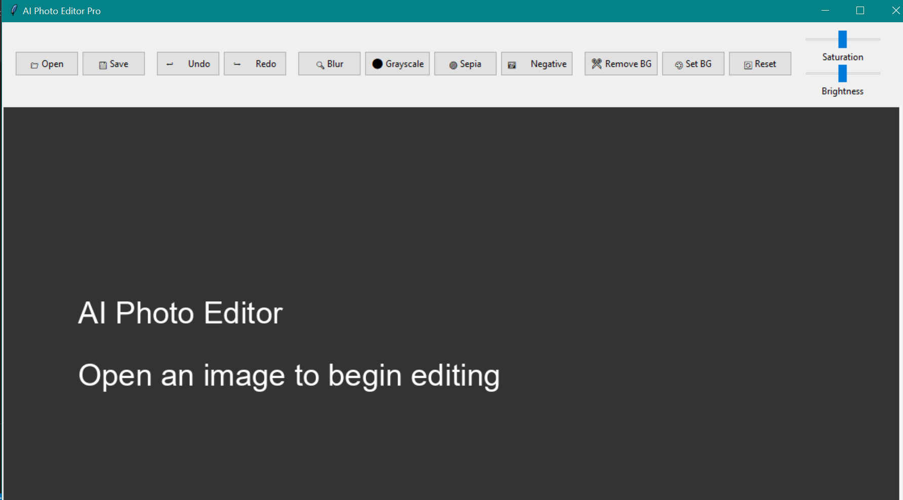
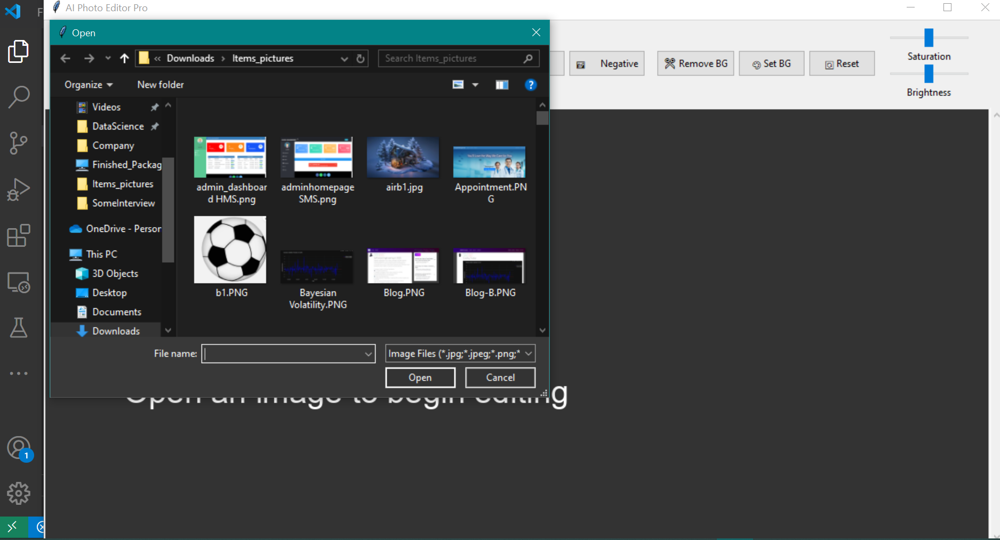
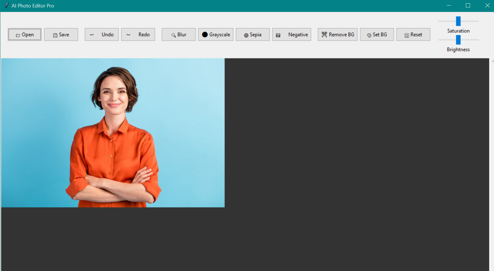
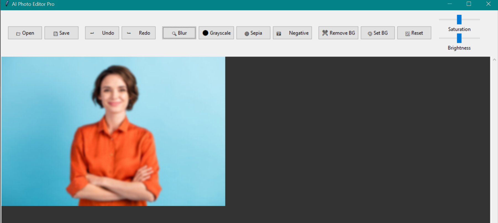
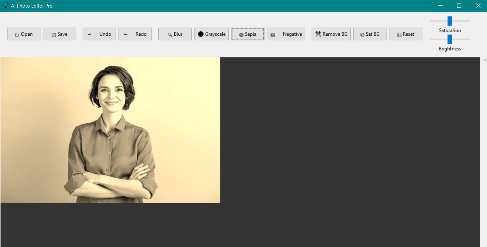

# AI Photo Editor Pro

  *Example screenshot of the editor in action*
 
 
 
 

A powerful desktop photo editing application built with Python, Tkinter, and OpenCV that provides both basic and advanced image manipulation capabilities.

## Features

### Core Functionality
- 🖼️ **Image Loading/Saving**: Open and save images in various formats (JPG, PNG, BMP)
- ⏮️ **Undo/Redo**: Full history support with 20-level undo/redo capability
- 🔍 **Zooming**: Interactive zoom with keyboard shortcuts (Ctrl+Plus/Minus/0)

### Basic Adjustments
- ☀️ **Brightness Control**: Adjust image brightness with a slider
- 🎨 **Saturation Control**: Modify color intensity with a slider
- ⚫ **Grayscale Conversion**: Convert images to black and white
- 🖼️ **Negative Effect**: Invert image colors

### Advanced Features
- 🔍 **Blur Effects**: Adjustable Gaussian blur with configurable radius
- 🟤 **Sepia Tone**: Apply vintage-style sepia filter
- ✂️ **Background Removal**: Automatic background removal using OpenCV's grabCut
- 🎨 **Custom Backgrounds**: Set any color as background for transparent images

### User Experience
- ⌨️ **Keyboard Shortcuts**: Quick access to common functions
- 📊 **Status Bar**: Displays image information and operation status
- 🖱️ **Scrollable Canvas**: View large images with scrollbars
- 🎨 **Modern UI**: Clean interface with themed controls

## Technologies Used

| Technology | Purpose |
|------------|---------|
| Python 3.x | Core programming language |
| Tkinter | GUI framework for the application |
| Pillow (PIL) | Image processing and manipulation |
| OpenCV (cv2) | Advanced image operations (background removal) |
| NumPy | Mathematical operations on image data |
| Azure Theme | Modern UI styling for Tkinter |

## Installation

1. **Prerequisites**:
   - Python 3.6 or higher
   - pip package manager

2. **Install dependencies**:
   ```bash
   pip install pillow opencv-python numpy